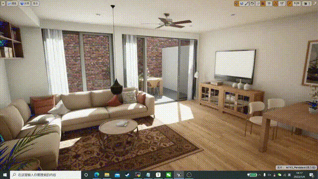
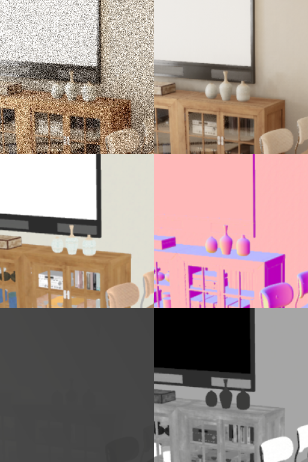

# Recurrent-Denoising-Autoencoder

Link to original paper (SIGGRAPH '17) : https://research.nvidia.com/publication/interactive-reconstruction-monte-carlo-image-sequences-using-recurrent-denoising

**note:** This is an unofficial PyTorch implementation of the above paper.

I also refer to the following links：

[AakashKT/pytorch-recurrent-ae-siggraph17: Pytorch implementation for 'Interactive Reconstruction of Monte Carlo Image Sequences using a Recurrent Denoising Autoencoder' ](https://github.com/AakashKT/pytorch-recurrent-ae-siggraph17);

## Requirements

- Python >= 3.5 (3.7 recommended)
- torchvision
- numpy
- tensorboard
- pandas
- pillow
- matplotlib
- openCV

To install other dependencies, you can use pip with :

```bash
pip install -r requirements.txt
```

## Demo

**The original video:**


**Video after noise reduction:**



## Folder Structure

The folder structure of the project is shown below:

```
├─Recurrent-Denoising-Autoencoder
  │  commend.txt                                        
  │  data_chn.py                                         
  │  example.png                                         
  │  grab_frame.py                                      
  │  losses_chn.py                                       
  │  measure.py                                          
  │  model_chn.py                                        
  │  test.py                                           
  │  train.py                                             
  │
  ├─logs_train                                            
  │      events.out.tfevents.1639969697.LAPTOP-HHJKMK56.22388.0
  │
  ├─output                                                
  │  └─seq_1
  │          1.png
  │          2.png
  │          3.png
  │          4.png
  │          5.png
  │          6.png
  │          7.png
  │
  ├─save                                                  
  │      chn_test_201.pt
  │
  ├─test_data                                  
  │  └─seq_1
  │          1.png
  │          2.png
  │          3.png
  │          4.png
  │          5.png
  │          6.png
  │          7.png
  │
  └─__pycache__
          data_chn.cpython-37.pyc
          losses_chn.cpython-37.pyc
          model_chn.cpython-37.pyc
```


## Dataset

#### The input to this network is :

- noisy input（1spp RGB image）
- target image 
- Albedo
- Depth
- Normal Map
- Roughness Map

Construct the input as one image, as follows :



#### The directory structure of train data:

- [DATA_DIRECTORY]/train]
  - [DATA_DIRECTORY]/train/seq_0/
  - [DATA_DIRECTORY]/train/seq_1/
  - ......

 There are 7 continuous frames in each [DATA_DIRECTORY]/train/seq_i

## Train

To train the network, run the following command :

```bash
python train.py --name [EXP_NAME] --data_dir  [PATH_TO_DATA_DIRECTORY]  --save_dir [PATH_TO_SAVE_CHECKPOINTS] --width [width of image] --height [height of image] --epochs 100
```

## Test

To test the network, run the following command : 

```bash
python test.py  --test_dir  [PATH_TO_DATA_DIRECTORY]   --output_dir [PATH_TO_SAVE_RESULTS]  --checkpoint [PATH_TO_CHECKPOINT].pt --width [width of image] --height [height of image]
```


